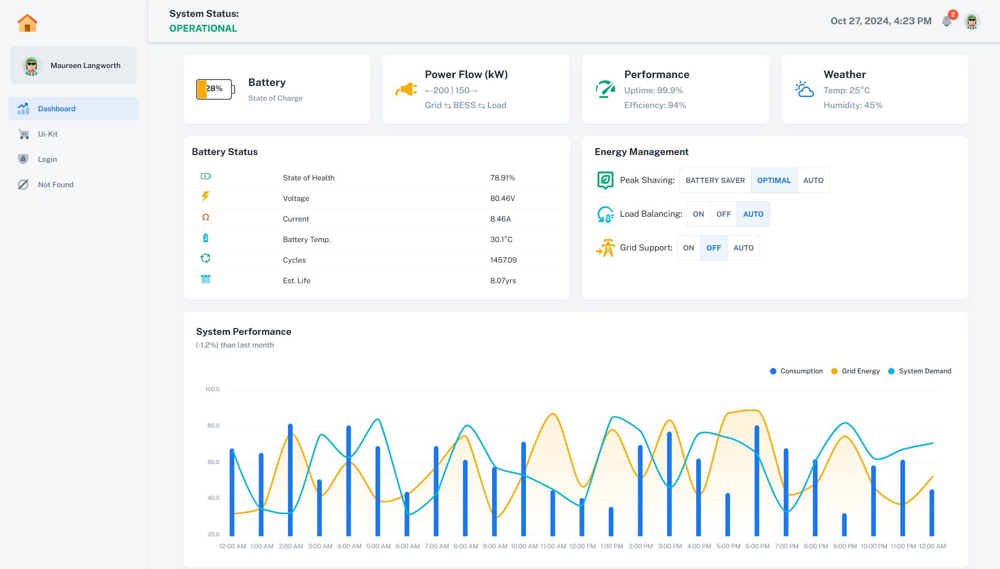

# BESS Real-Time Monitoring Dashboard
# [Live Demo of Dashboard](https://battery-energy-storage-system-monitor.netlify.app/)
https://battery-energy-storage-system-monitor.netlify.app/

## Overview

This repository contains the frontend code for a real-time monitoring dashboard designed for Battery Energy Storage System (BESS) installations. The dashboard provides a comprehensive view of BESS performance, status, and key operational metrics.

## Features

- Real-time monitoring of BESS installation
- Interactive power flow visualization
- Battery status and health monitoring
- Environmental data display
- Performance graphing with historical data
- Alert management system
- Predictive analytics for energy demand and savings
- Quick action controls for system management

## Technology Stack

- Frontend Framework: React with JavaScript (includes prop-types)
- Real-time updates
- Charting Library: chart.js
- UI Component Library: Material-UI
- Build Tool: Vite

## Getting Started

### Prerequisites

- Node.js (v22 or later)
- npm (v10.9 or later)
- yarn (v1.22.22 or later)

###